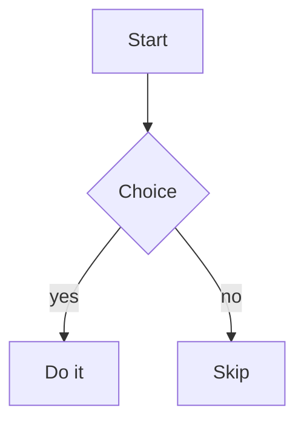

# Mermaid

Renders fenced `​```mermaid` code blocks as [Mermaid](https://mermaid.js.org/) diagrams.

## Activate

Pipeline only (emits the markup):

```csharp
new MarkdownPipelineBuilder().UseMermaid().Build();
```

With the runtime + init (HTML feature):

```csharp
new MarkdownHtmlFeatures().UseMermaid();
```

## Syntax

````text

````

## Output

The code block becomes a container Mermaid can process:

```html
<pre class="mermaid">graph TD
    A[Start] --> B{Choice}
    ...
</pre>
```

The `MermaidFeature` bundles the all-in-one Mermaid runtime as an asset (`mermaid.min.js`) and
adds an initializer that picks a light/dark theme from `prefers-color-scheme` and calls
`mermaid.run()`. Because the block has no `<code>` child, it is ignored by syntax highlighting.

> The Mermaid bundle is large (~3.5 MB). Prefer `External` asset delivery for desktop/WebView
> hosts so the page stays small and the runtime is cached as a file.
